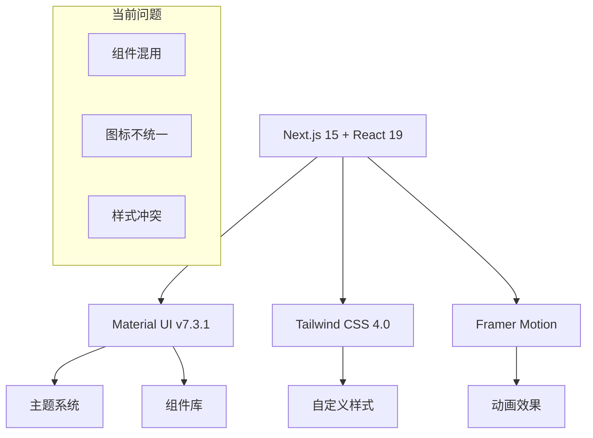
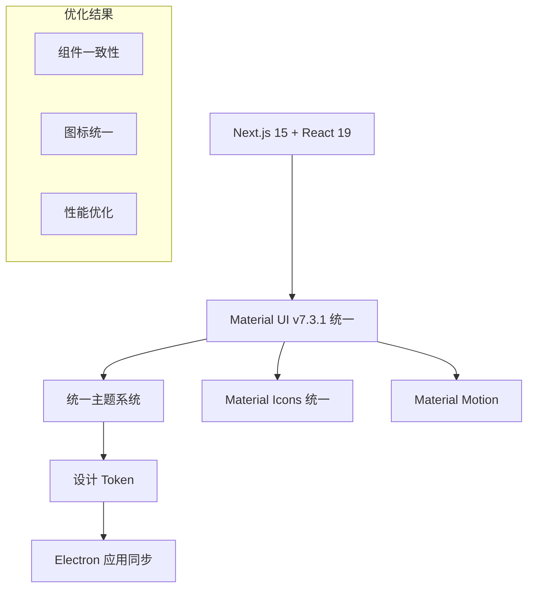

# FileZen Material Design 技术实施指南

## 1. 技术架构概览

### 1.1 当前技术栈分析



### 1.2 目标架构



## 2. 核心技术实施

### 2.1 主题系统重构

#### 当前主题配置优化

```typescript
// src/lib/theme.ts - 优化版本
'use client';

import { createTheme, ThemeOptions } from '@mui/material/styles';
import { zhCN, enUS } from '@mui/material/locale';

// Material Design 3 色彩系统
const materialColors = {
  primary: {
    main: '#FF8C42',
    light: '#FFB366', 
    dark: '#E6732A',
    contrastText: '#FFFFFF'
  },
  secondary: {
    main: '#FFD93D',
    light: '#FFE066',
    dark: '#E6C42A', 
    contrastText: '#000000'
  },
  success: {
    main: '#4ECDC4',
    light: '#7EDDD6',
    dark: '#3BB5AD',
    contrastText: '#FFFFFF'
  },
  warning: {
    main: '#FFB347',
    light: '#FFC266',
    dark: '#E69A2E',
    contrastText: '#000000'
  },
  error: {
    main: '#FF6B6B',
    light: '#FF8A8A', 
    dark: '#E65252',
    contrastText: '#FFFFFF'
  },
  info: {
    main: '#74B9FF',
    light: '#93C7FF',
    dark: '#5BA3E6',
    contrastText: '#FFFFFF'
  }
};

// Material Design 3 表面色彩
const surfaceColors = {
  light: {
    surface: '#FFFBFE',
    surfaceVariant: '#F4EFF4',
    surfaceContainer: '#F9F5F9',
    surfaceContainerHigh: '#F3EFF3',
    surfaceContainerHighest: '#EDE9ED'
  },
  dark: {
    surface: '#141218',
    surfaceVariant: '#49454F',
    surfaceContainer: '#211F26',
    surfaceContainerHigh: '#2B2930',
    surfaceContainerHighest: '#36343B'
  }
};

// 增强的组件样式
const enhancedComponents: ThemeOptions['components'] = {
  MuiButton: {
    styleOverrides: {
      root: {
        textTransform: 'none',
        borderRadius: 12,
        padding: '10px 24px',
        fontSize: '1rem',
        fontWeight: 600,
        fontFamily: ['Nunito', 'PingFang SC', 'sans-serif'].join(','),
        boxShadow: 'none',
        '&:hover': {
          boxShadow: '0 2px 8px rgba(0, 0, 0, 0.15)',
        },
        // Material Design 3 状态层
        '&:focus': {
          boxShadow: '0 0 0 3px rgba(255, 140, 66, 0.12)',
        }
      },
      contained: {
        '&:hover': {
          boxShadow: '0 4px 12px rgba(0, 0, 0, 0.15)',
        }
      }
    }
  },
  MuiCard: {
    styleOverrides: {
      root: {
        borderRadius: 16,
        boxShadow: '0 1px 3px rgba(0, 0, 0, 0.12), 0 1px 2px rgba(0, 0, 0, 0.24)',
        transition: 'box-shadow 0.3s cubic-bezier(0.4, 0, 0.2, 1)',
        '&:hover': {
          boxShadow: '0 4px 6px rgba(0, 0, 0, 0.12), 0 2px 4px rgba(0, 0, 0, 0.08)',
        }
      }
    }
  },
  MuiTextField: {
    styleOverrides: {
      root: {
        '& .MuiOutlinedInput-root': {
          borderRadius: 12,
          fontFamily: ['Nunito', 'PingFang SC', 'sans-serif'].join(','),
          '&:hover .MuiOutlinedInput-notchedOutline': {
            borderColor: materialColors.primary.light,
          },
          '&.Mui-focused .MuiOutlinedInput-notchedOutline': {
            borderWidth: 2,
            borderColor: materialColors.primary.main,
          }
        }
      }
    }
  },
  MuiAppBar: {
    styleOverrides: {
      root: {
        boxShadow: '0 2px 4px rgba(0, 0, 0, 0.1)',
        backdropFilter: 'blur(8px)',
      }
    }
  },
  // 新增：Material Design 3 导航组件
  MuiBottomNavigation: {
    styleOverrides: {
      root: {
        borderRadius: '16px 16px 0 0',
      }
    }
  }
};
```

#### 设计 Token 系统

```typescript
// src/lib/design-tokens.ts - 新建文件
export const designTokens = {
  // 间距系统 (8dp 网格)
  spacing: {
    xs: 4,
    sm: 8, 
    md: 16,
    lg: 24,
    xl: 32,
    xxl: 48
  },
  
  // 圆角系统
  borderRadius: {
    small: 8,
    medium: 12,
    large: 16,
    extraLarge: 24
  },
  
  // 阴影系统
  shadows: {
    level1: '0 1px 3px rgba(0, 0, 0, 0.12), 0 1px 2px rgba(0, 0, 0, 0.24)',
    level2: '0 3px 6px rgba(0, 0, 0, 0.16), 0 3px 6px rgba(0, 0, 0, 0.23)',
    level3: '0 10px 20px rgba(0, 0, 0, 0.19), 0 6px 6px rgba(0, 0, 0, 0.23)',
    level4: '0 14px 28px rgba(0, 0, 0, 0.25), 0 10px 10px rgba(0, 0, 0, 0.22)',
    level5: '0 19px 38px rgba(0, 0, 0, 0.30), 0 15px 12px rgba(0, 0, 0, 0.22)'
  },
  
  // 动画时长
  transitions: {
    fast: '150ms',
    normal: '300ms', 
    slow: '500ms'
  },
  
  // 动画缓动函数
  easing: {
    standard: 'cubic-bezier(0.4, 0, 0.2, 1)',
    decelerate: 'cubic-bezier(0, 0, 0.2, 1)',
    accelerate: 'cubic-bezier(0.4, 0, 1, 1)'
  }
};
```

### 2.2 组件迁移策略

#### 移除自定义 Button 组件

```typescript
// 删除 src/components/ui/button.tsx
// 删除 src/components/ui/ModernButton.tsx

// 更新 src/components/ui/index.ts
export { Button } from '@mui/material';
export type { ButtonProps } from '@mui/material';

// 其他组件保持 Material UI 导入
export { TextField as Input } from '@mui/material';
export type { TextFieldProps as InputProps } from '@mui/material';

export { Card, CardHeader, CardContent, CardActions as CardFooter } from '@mui/material';
export type { 
  CardProps, 
  CardHeaderProps, 
  CardContentProps, 
  CardActionsProps as CardFooterProps 
} from '@mui/material';
```

#### 统一图标系统

```typescript
// src/components/icons/index.ts - 新建统一图标导出
export {
  Download,
  CalendarToday,
  Menu as MenuIcon,
  Close as CloseIcon,
  GitHub,
  Twitter,
  LinkedIn,
  Email,
  Language as LanguageIcon,
  ErrorOutline,
  Refresh,
  Home,
  BugReport,
  ArrowBack,
  Search
} from '@mui/icons-material';

// 如果需要自定义图标，使用 SvgIcon 包装
import { SvgIcon, SvgIconProps } from '@mui/material';

export const FileZenIcon: React.FC<SvgIconProps> = (props) => (
  <SvgIcon {...props}>
    {/* 自定义 SVG 路径 */}
  </SvgIcon>
);
```

### 2.3 页面组件更新

#### Header 组件优化

```typescript
// src/components/layout/header.tsx - 关键更新
import React, { useState, useCallback } from 'react';
import {
  AppBar,
  Toolbar,
  Container,
  Button,
  IconButton,
  useMediaQuery,
  useTheme,
  Box,
  Drawer,
  List,
  ListItem,
  ListItemButton,
  ListItemText
} from '@mui/material';
import { MenuIcon, CloseIcon } from '@/components/icons';
import { motion } from 'framer-motion';

// 使用 Material Design 的移动端导航模式
const MobileNavigation = ({ open, onClose, navItems }) => (
  <Drawer
    anchor="right"
    open={open}
    onClose={onClose}
    PaperProps={{
      sx: {
        width: 280,
        borderRadius: '16px 0 0 16px',
        background: 'linear-gradient(135deg, rgba(255,140,66,0.1) 0%, rgba(255,217,61,0.1) 100%)'
      }
    }}
  >
    <List>
      {navItems.map((item) => (
        <ListItem key={item.label} disablePadding>
          <ListItemButton
            component={Link}
            href={item.href}
            onClick={onClose}
            sx={{ borderRadius: 2, mx: 1 }}
          >
            <ListItemText primary={item.label} />
          </ListItemButton>
        </ListItem>
      ))}
    </List>
  </Drawer>
);
```

#### 主页组件优化

```typescript
// src/app/[locale]/page.tsx - 使用统一的 Material UI 组件
import React, { useState, useCallback } from 'react';
import { useTranslations } from 'next-intl';
import { 
  Container, 
  Typography, 
  Box, 
  Button,
  Card,
  CardContent,
  Grid,
  Chip
} from '@mui/material';
import { Download, CalendarToday } from '@/components/icons';
import { MainLayout, ReservationForm } from '@/components';

// 移除 ModernButton，使用 Material UI Button
const DownloadButton = () => (
  <Button
    variant="contained"
    size="large"
    startIcon={<Download />}
    sx={{
      borderRadius: 3,
      px: 4,
      py: 1.5,
      fontSize: '1.1rem',
      fontWeight: 600,
      background: 'linear-gradient(135deg, #FF8C42 0%, #FFB366 100%)',
      '&:hover': {
        background: 'linear-gradient(135deg, #E6732A 0%, #FF8C42 100%)',
        transform: 'translateY(-2px)',
        boxShadow: '0 8px 25px rgba(255, 140, 66, 0.3)'
      },
      transition: 'all 0.3s cubic-bezier(0.4, 0, 0.2, 1)'
    }}
  >
    立即下载
  </Button>
);
```

## 3. 性能优化策略

### 3.1 Tree Shaking 优化

```typescript
// 推荐的导入方式
// ❌ 避免整体导入
import * as MUI from '@mui/material';

// ✅ 按需导入
import { Button, TextField, Card } from '@mui/material';
import { Download, Menu } from '@mui/icons-material';
```

### 3.2 主题缓存优化

```typescript
// src/components/theme-provider.tsx - 优化版本
import React, { createContext, useContext, useEffect, useState, useMemo } from 'react';
import { ThemeProvider as MuiThemeProvider, createTheme } from '@mui/material/styles';
import { CssBaseline } from '@mui/material';
import { lightTheme, darkTheme } from '@/lib/theme';

const ThemeProvider = ({ children }) => {
  const [mode, setMode] = useState<'light' | 'dark'>('light');
  const [locale, setLocale] = useState<'zh' | 'en'>('zh');
  
  // 缓存主题对象
  const theme = useMemo(() => {
    return mode === 'light' ? lightTheme(locale) : darkTheme(locale);
  }, [mode, locale]);
  
  return (
    <MuiThemeProvider theme={theme}>
      <CssBaseline />
      {children}
    </MuiThemeProvider>
  );
};
```

### 3.3 动画性能优化

```typescript
// src/lib/animations.ts - Material Motion 实现
export const materialMotion = {
  // 标准进入动画
  fadeInUp: {
    initial: { opacity: 0, y: 20 },
    animate: { opacity: 1, y: 0 },
    transition: { duration: 0.3, ease: [0.4, 0, 0.2, 1] }
  },
  
  // 卡片悬停效果
  cardHover: {
    whileHover: { 
      y: -4,
      boxShadow: '0 8px 25px rgba(0, 0, 0, 0.15)',
      transition: { duration: 0.2, ease: [0.4, 0, 0.2, 1] }
    }
  },
  
  // 按钮点击效果
  buttonTap: {
    whileTap: { scale: 0.95 },
    transition: { duration: 0.1, ease: [0.4, 0, 0.2, 1] }
  }
};
```

## 4. 与 Electron 应用同步

### 4.1 设计 Token 共享

```json
// design-tokens.json - 跨平台共享
{
  "colors": {
    "primary": {
      "main": "#FF8C42",
      "light": "#FFB366",
      "dark": "#E6732A"
    },
    "secondary": {
      "main": "#FFD93D",
      "light": "#FFE066", 
      "dark": "#E6C42A"
    }
  },
  "spacing": {
    "xs": 4,
    "sm": 8,
    "md": 16,
    "lg": 24,
    "xl": 32
  },
  "borderRadius": {
    "small": 8,
    "medium": 12,
    "large": 16
  }
}
```

### 4.2 Electron 应用集成指南

```typescript
// electron-app/src/styles/material-theme.ts
import designTokens from '../../../design-tokens.json';

// 将设计 Token 转换为 CSS 变量
export const materialTheme = {
  '--color-primary': designTokens.colors.primary.main,
  '--color-primary-light': designTokens.colors.primary.light,
  '--color-primary-dark': designTokens.colors.primary.dark,
  '--spacing-sm': `${designTokens.spacing.sm}px`,
  '--spacing-md': `${designTokens.spacing.md}px`,
  '--border-radius-medium': `${designTokens.borderRadius.medium}px`
};
```

## 5. 测试与验证

### 5.1 视觉回归测试

```typescript
// tests/visual-regression.test.ts
import { test, expect } from '@playwright/test';

test.describe('Material Design 一致性测试', () => {
  test('按钮样式一致性', async ({ page }) => {
    await page.goto('/components/buttons');
    await expect(page.locator('[data-testid="primary-button"]')).toHaveScreenshot('primary-button.png');
  });
  
  test('卡片组件一致性', async ({ page }) => {
    await page.goto('/components/cards');
    await expect(page.locator('[data-testid="feature-card"]')).toHaveScreenshot('feature-card.png');
  });
});
```

### 5.2 主题切换测试

```typescript
// tests/theme-switching.test.ts
test('主题切换功能', async ({ page }) => {
  await page.goto('/');
  
  // 测试浅色主题
  await expect(page.locator('body')).toHaveCSS('background-color', 'rgb(255, 248, 240)');
  
  // 切换到深色主题
  await page.click('[data-testid="theme-toggle"]');
  await expect(page.locator('body')).toHaveCSS('background-color', 'rgb(18, 18, 24)');
});
```

## 6. 部署与监控

### 6.1 构建优化

```typescript
// next.config.ts - Material UI 优化配置
const nextConfig = {
  experimental: {
    optimizePackageImports: ['@mui/material', '@mui/icons-material']
  },
  
  // 启用 Material UI 的 CSS-in-JS 优化
  compiler: {
    emotion: true
  }
};
```

### 6.2 性能监控

```typescript
// src/lib/performance.ts
export const trackMaterialUIPerformance = () => {
  // 监控主题切换性能
  const observer = new PerformanceObserver((list) => {
    list.getEntries().forEach((entry) => {
      if (entry.name.includes('theme-switch')) {
        console.log('主题切换耗时:', entry.duration);
      }
    });
  });
  
  observer.observe({ entryTypes: ['measure'] });
};
```

## 7. 迁移检查清单

### 7.1 组件迁移
- [ ] 移除 `src/components/ui/button.tsx`
- [ ] 移除 `src/components/ui/ModernButton.tsx`
- [ ] 更新所有 Button 引用为 `@mui/material/Button`
- [ ] 统一图标导入为 `@mui/icons-material`
- [ ] 更新主题配置文件
- [ ] 创建设计 Token 文件

### 7.2 样式统一
- [ ] 移除 Tailwind CSS 中与 Material UI 冲突的样式
- [ ] 统一圆角使用 Material UI 主题
- [ ] 统一颜色使用主题色彩系统
- [ ] 统一间距使用 8dp 网格系统

### 7.3 测试验证
- [ ] 视觉回归测试通过
- [ ] 响应式设计测试通过
- [ ] 主题切换功能正常
- [ ] 无障碍性测试通过
- [ ] 性能指标符合预期

### 7.4 文档更新
- [ ] 更新组件使用文档
- [ ] 创建设计规范文档
- [ ] 更新开发指南
- [ ] 同步 Electron 应用文档

---

**实施优先级**: 高优先级项目应在 1-2 天内完成，确保核心功能不受影响的前提下逐步优化设计一致性。