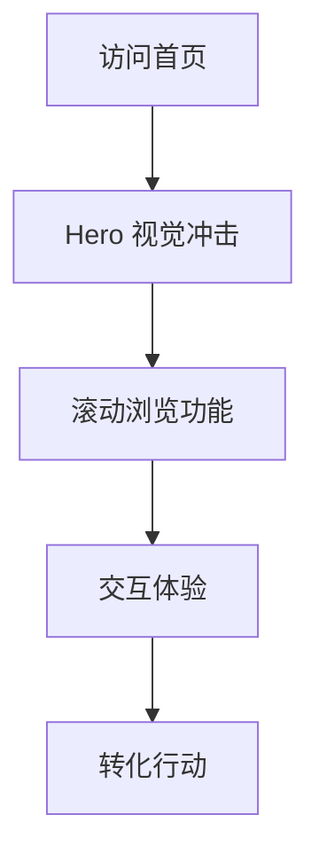

# FileZen 官网设计改进方案

## 1. 产品概述

FileZen 官网当前设计过于简单，缺乏视觉吸引力和现代感。本次改进旨在打造一个具有强烈视觉冲击力、优秀用户体验的现代化网站，提升品牌形象和用户转化率。

目标：通过现代化的设计语言、丰富的视觉效果和优秀的交互体验，将 FileZen 官网打造成行业领先的产品展示平台。

## 2. 核心功能

### 2.1 用户角色
本次设计改进不涉及用户角色区分，主要面向所有访问者提供统一的浏览体验。

### 2.2 功能模块
设计改进涉及以下主要页面：
1. **首页 Hero 区域**：主要视觉展示区域，包含产品介绍、CTA 按钮和视觉效果
2. **功能特性区域**：产品核心功能展示，采用卡片式布局
3. **导航栏**：全局导航，包含品牌标识和主要功能入口
4. **交互组件**：按钮、表单、弹窗等用户交互元素

### 2.3 页面详情

| 页面名称 | 模块名称 | 功能描述 |
|---------|---------|----------|
| 首页 | Hero 区域 | 重新设计主视觉区域，添加动态背景、渐变效果、动画元素，提升视觉冲击力 |
| 首页 | 功能特性区域 | 优化卡片设计，添加悬停效果、阴影层次、图标动画，提升交互体验 |
| 全局 | 导航栏 | 现代化导航设计，毛玻璃效果、平滑滚动隐藏、响应式适配 |
| 全局 | 按钮组件 | 重新设计按钮样式，添加渐变背景、悬停动画、加载状态 |
| 全局 | 色彩系统 | 建立现代化配色方案，包含主色调、辅助色、渐变色板 |
| 全局 | 动画系统 | 添加页面加载动画、滚动触发动画、微交互效果 |

## 3. 核心流程

用户访问流程保持不变，主要优化视觉体验：
1. 用户访问首页 → 看到震撼的 Hero 视觉效果
2. 滚动浏览功能特性 → 体验流畅的动画和精美的卡片设计
3. 点击 CTA 按钮 → 享受优雅的交互反馈
4. 浏览其他页面 → 感受一致的现代化设计语言

## 4. 用户界面设计

### 4.1 设计风格

**配色方案：**
- 主色调：深蓝渐变 (#1e40af → #3b82f6)
- 辅助色：紫色渐变 (#7c3aed → #a855f7)
- 强调色：橙红渐变 (#ea580c → #ef4444)
- 中性色：现代灰色系 (#f8fafc → #1e293b)

**视觉元素：**
- 按钮风格：圆角渐变按钮，悬停时缩放和阴影变化
- 字体：系统字体栈，优先 SF Pro Display / PingFang SC
- 布局风格：卡片式设计，大量留白，层次分明
- 动画风格：流畅的缓动函数，适度的弹性效果

**特效元素：**
- 毛玻璃效果 (backdrop-filter: blur)
- 渐变背景和边框
- 粒子动画背景
- 滚动视差效果
- 微交互动画

### 4.2 页面设计概览

| 页面名称 | 模块名称 | UI 元素 |
|---------|---------|--------|
| 首页 | Hero 区域 | 大标题渐变文字、动态背景粒子、3D 悬浮卡片效果、渐变 CTA 按钮组、产品预览图阴影效果 |
| 首页 | 功能特性 | 渐变背景卡片、图标动画效果、悬停时卡片上浮、彩色图标背景、文字渐变效果 |
| 全局 | 导航栏 | 毛玻璃背景、滚动时渐隐效果、Logo 动画、语言切换动画、主题切换平滑过渡 |
| 全局 | 按钮系统 | 主按钮渐变背景、次要按钮边框动画、悬停缩放效果、点击波纹效果、加载状态动画 |

### 4.3 响应式设计

采用 Mobile-first 设计理念：
- 移动端优先，确保小屏幕设备的最佳体验
- 平板和桌面端渐进增强，添加更丰富的动画效果
- 触摸设备优化，增大点击区域，优化手势交互
- 性能优化，在低性能设备上降级动画效果

**断点设置：**
- 移动端：< 768px
- 平板端：768px - 1024px  
- 桌面端：> 1024px

**适配策略：**
- 移动端：简化动画，优化加载速度
- 平板端：适中的动画效果，平衡性能和体验
- 桌面端：完整的动画效果，最佳视觉体验