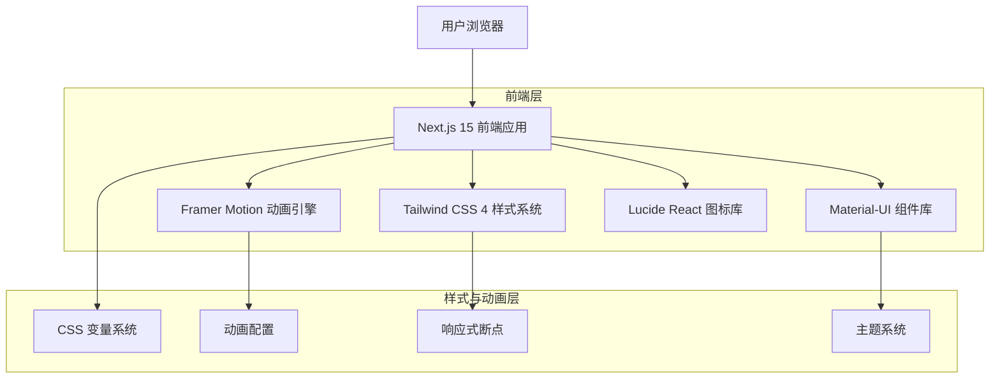

# FileZen 官网设计改进技术架构文档

## 1. 架构设计



## 2. 技术描述

**前端技术栈：**
- 框架：Next.js 15 + React 19 + TypeScript
- 样式：Tailwind CSS 4 + CSS Modules
- 动画：Framer Motion + CSS Animations
- UI 组件：Material-UI (保持现有)
- 图标：Lucide React
- 构建工具：Vite (Next.js 内置)

**核心依赖：**
```json
{
  "framer-motion": "^11.0.0",
  "@tailwindcss/typography": "^0.5.0",
  "@tailwindcss/forms": "^0.5.0",
  "react-intersection-observer": "^9.0.0",
  "lottie-react": "^2.4.0"
}
```

## 3. 路由定义

设计改进不涉及路由变更，保持现有路由结构：

| 路由 | 用途 | 设计改进重点 |
|------|------|-------------|
| /[locale] | 首页 | Hero 区域重新设计，功能特性卡片优化 |
| /[locale]/features | 功能页面 | 统一设计语言，添加动画效果 |
| /[locale]/download | 下载页面 | 优化 CTA 按钮和下载流程视觉 |
| /[locale]/about | 关于页面 | 品牌故事可视化展示 |

## 4. 组件架构设计

### 4.1 核心设计组件

**动画组件系统：**
```typescript
// 滚动触发动画组件
interface ScrollAnimationProps {
  children: React.ReactNode;
  animation: 'fadeInUp' | 'fadeInLeft' | 'fadeInRight' | 'scaleIn';
  delay?: number;
  duration?: number;
}

// 渐变文字组件
interface GradientTextProps {
  children: React.ReactNode;
  gradient: 'primary' | 'secondary' | 'accent';
  className?: string;
}

// 悬浮卡片组件
interface FloatingCardProps {
  children: React.ReactNode;
  hoverEffect: 'lift' | 'glow' | 'tilt';
  className?: string;
}
```

**按钮系统重构：**
```typescript
// 现代化按钮组件
interface ModernButtonProps {
  variant: 'primary' | 'secondary' | 'ghost' | 'outline';
  size: 'sm' | 'md' | 'lg' | 'xl';
  loading?: boolean;
  icon?: React.ReactNode;
  gradient?: boolean;
  children: React.ReactNode;
}
```

### 4.2 页面组件重构

**Hero 区域组件：**
```typescript
// 新 Hero 组件结构
interface HeroSectionProps {
  title: string;
  subtitle: string;
  ctaButtons: {
    primary: { text: string; href: string };
    secondary: { text: string; href: string };
  };
  backgroundAnimation: 'particles' | 'gradient' | 'geometric';
}
```

**功能特性组件：**
```typescript
// 重新设计的特性卡片
interface FeatureCardProps {
  icon: React.ReactNode;
  title: string;
  description: string;
  gradient: string;
  animationDelay: number;
}
```

## 5. 样式系统架构

### 5.1 Tailwind CSS 配置扩展

```javascript
// tailwind.config.js 扩展
module.exports = {
  theme: {
    extend: {
      colors: {
        primary: {
          50: '#eff6ff',
          500: '#3b82f6',
          600: '#2563eb',
          700: '#1d4ed8',
          900: '#1e3a8a'
        },
        gradient: {
          'blue-purple': 'linear-gradient(135deg, #667eea 0%, #764ba2 100%)',
          'orange-red': 'linear-gradient(135deg, #f093fb 0%, #f5576c 100%)',
          'green-blue': 'linear-gradient(135deg, #4facfe 0%, #00f2fe 100%)'
        }
      },
      animation: {
        'float': 'float 6s ease-in-out infinite',
        'pulse-slow': 'pulse 4s cubic-bezier(0.4, 0, 0.6, 1) infinite',
        'bounce-slow': 'bounce 3s infinite'
      },
      backdropBlur: {
        xs: '2px'
      }
    }
  }
}
```

### 5.2 CSS 变量系统

```css
/* 设计系统变量 */
:root {
  /* 渐变色板 */
  --gradient-primary: linear-gradient(135deg, #667eea 0%, #764ba2 100%);
  --gradient-secondary: linear-gradient(135deg, #f093fb 0%, #f5576c 100%);
  --gradient-accent: linear-gradient(135deg, #4facfe 0%, #00f2fe 100%);
  
  /* 阴影系统 */
  --shadow-soft: 0 4px 6px -1px rgba(0, 0, 0, 0.1);
  --shadow-medium: 0 10px 15px -3px rgba(0, 0, 0, 0.1);
  --shadow-large: 0 25px 50px -12px rgba(0, 0, 0, 0.25);
  
  /* 动画缓动 */
  --ease-out-cubic: cubic-bezier(0.33, 1, 0.68, 1);
  --ease-in-out-cubic: cubic-bezier(0.65, 0, 0.35, 1);
}
```

## 6. 动画系统架构

### 6.1 Framer Motion 配置

```typescript
// 动画预设配置
export const animationPresets = {
  fadeInUp: {
    initial: { opacity: 0, y: 60 },
    animate: { opacity: 1, y: 0 },
    transition: { duration: 0.6, ease: [0.33, 1, 0.68, 1] }
  },
  scaleIn: {
    initial: { opacity: 0, scale: 0.8 },
    animate: { opacity: 1, scale: 1 },
    transition: { duration: 0.5, ease: "easeOut" }
  },
  slideInLeft: {
    initial: { opacity: 0, x: -60 },
    animate: { opacity: 1, x: 0 },
    transition: { duration: 0.6, ease: [0.33, 1, 0.68, 1] }
  }
};

// 悬停动画配置
export const hoverAnimations = {
  lift: {
    whileHover: { y: -8, transition: { duration: 0.2 } }
  },
  scale: {
    whileHover: { scale: 1.05, transition: { duration: 0.2 } }
  },
  glow: {
    whileHover: { 
      boxShadow: "0 0 20px rgba(59, 130, 246, 0.5)",
      transition: { duration: 0.2 }
    }
  }
};
```

### 6.2 性能优化策略

```typescript
// 动画性能优化
export const optimizedAnimationConfig = {
  // 减少重绘的属性
  layoutId: "unique-id",
  // GPU 加速
  style: { willChange: "transform" },
  // 减少动画复杂度
  transition: { type: "tween", ease: "easeOut" }
};

// 响应式动画控制
export const useResponsiveAnimation = () => {
  const [shouldAnimate, setShouldAnimate] = useState(true);
  
  useEffect(() => {
    // 检测设备性能和偏好
    const mediaQuery = window.matchMedia('(prefers-reduced-motion: reduce)');
    setShouldAnimate(!mediaQuery.matches);
  }, []);
  
  return shouldAnimate;
};
```

## 7. 实施计划

### 7.1 开发阶段

**第一阶段：基础设施搭建**
1. 安装和配置 Framer Motion
2. 扩展 Tailwind CSS 配置
3. 建立设计系统变量
4. 创建基础动画组件

**第二阶段：核心组件重构**
1. 重新设计 Hero 区域
2. 优化功能特性卡片
3. 升级按钮系统
4. 改进导航栏设计

**第三阶段：动画和交互**
1. 添加页面加载动画
2. 实现滚动触发动画
3. 优化悬停和点击效果
4. 性能优化和测试

### 7.2 性能考虑

- 使用 `transform` 和 `opacity` 进行动画，避免触发重排
- 实现动画的懒加载和条件渲染
- 在低性能设备上降级动画效果
- 使用 `will-change` 属性优化 GPU 加速
- 监控 Core Web Vitals 指标